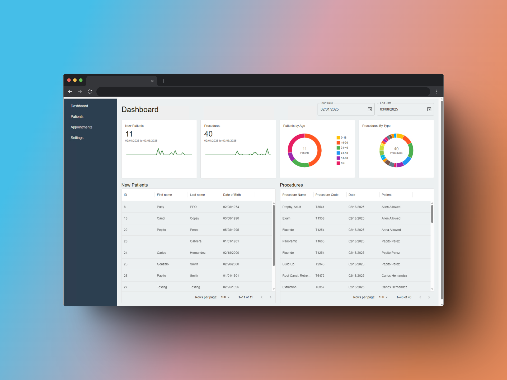

# Open Dental Reports & Insights



A full-stack web application designed to connect to an Open Dental Database in a local environment. The application uses Express.JS for the backend and React for the frontend, styled with MUI. It is intended to be hosted on a local server at each dental practice, making it accessible to everyone on the internal local network. Future versions will include a robust Authentication and Authorization workflow.

## Table of Contents

- [Overview](#overview)
- [Features](#features)
- [Architecture](#architecture)
- [Getting Started](#getting-started)
  - [Prerequisites](#prerequisites)
  - [Installation](#installation)
  - [Configuration](#configuration)
- [Usage](#usage)
- [Future Enhancements](#future-enhancements)
- [Contributing](#contributing)
- [Contact](#contact)

## Overview

This project connects to an Open Dental Database to generate insightful reports for dental practices. By hosting the app on the local server, every user on the internal network can access the application. It streamlines dental practice management by providing real-time reports and analytics.

## Features

- **Full-Stack Web Application:** Backend built on Express.JS and frontend built with React.
- **Modern UI/UX:** Styled with Material UI (MUI) for a sleek and responsive design.
- **Database Connectivity:** Uses environment variables to connect to the local Open Dental Database.
- **Report Generation:** Generates various reports such as daily appointments, financial metrics, and treatment summaries.
- **Local Hosting:** Designed to run on a local server, accessible within the internal network.
- **Future-Ready:** Upcoming versions will introduce Authentication and Authorization workflows.

## Architecture

The repository is structured with two main directories:
- **backend/** – Contains the Express.JS backend code and configuration.
- **frontend/** – Contains the React frontend code.

## Getting Started

### Prerequisites

- **Node.js** (v14 or later)
- **npm** Node package manager
- A local instance of the Open Dental Database (e.g., MySQL)

### Installation

1. **Clone the Repository:**

    ``` bash
    git clone https://github.com/yourusername/open-dental-reports.git
    ```
2. **Install Backend Dependencies:**
    Navigate to the backend folder and install dependencies:

    ``` bash
    cd open-dental-reports/backend
    npm install
    ```
3. **Install Frontend Dependencies:**
    Navigate to the frontend folder and install dependencies:

    ``` bash
    cd ../frontend
    npm install
    ```
### Configuration

#### Backend
In the ```backend``` folder, create a ```.env``` file with the following environment variables. These variables are used to connect to your local Open Dental Database:

``` env
DB_USER=your_database_user
DB_PASS=your_database_password
DB_NAME=your_database_name
DB_HOST=your_database_host
DB_PORT=your_database_port
```
Ensure that the database details match your local setup

## Usage

### Running the Backend Server
Navigate to the ```backend``` directory and start the server:

``` bash
cd open-dental-reports/backend
npm start
```

### Running the Frontend Application
Open a new terminal, navigate to the ```frontend``` directory, and start the React application:

``` bash
cd open-dental-reports/frontend
npm start
```

The React app should now be accessible in your browser, typically at ```http://localhost:5173```.

## Future Enhancements
- **Authentication & Authorization:** Implement secure user authentication and role-based access control.
- **Advanced Reporting:** Expand the variety of reports and offer more customization options.
- **API Enhancements:** Further optimize the backend APIs for performance and scalability.

## Contributing
Contributions are welcome! If you'd like to contribute:
- Fork the repository.
- Create a new branch for your feature or bug fix.
- Commit your changes with descriptive messages.
- Open a pull request detailing your changes.

Please follow the coding guidelines and include tests for new features or bug fixes.

## Contact
For questions or support, please open an issue in the repository.